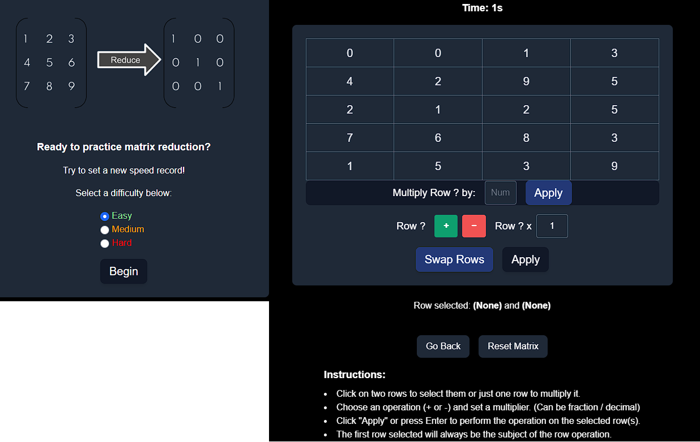

# Matrix Reduction Practice Platform



An interactive platform designed to help users practice and learn **Row Reduced Echelon Form (RREF)** reduction through hands-on matrix manipulation. The platform includes real-time feedback and tools for performing row operations like addition, subtraction, and scaling.

---

## 🚀 Features

- **Interactive Matrix Manipulation**: Perform common row operations, including row addition, subtraction, multiplication, and swapping.
- **Real-Time Stopwatch**: Tracks the time taken to solve the matrix.
- **Backend Validation**: Communicates with a Flask-based API to check if the matrix is in reduced row echelon form (RREF).
- **Responsive Design**: Optimized for all devices using modern UI technologies.
- **Keyboard Shortcuts**: Apply operations quickly using the Enter key and other intuitive controls.

---

## 🛠️ Technologies Used

### Frontend
- **Next.js**: A React-based framework that provides server-side rendering and static site generation for better performance and SEO.
- **Tailwind CSS**: A utility-first CSS framework for building modern, responsive designs with ease.
- **TypeScript**: Ensures type safety and better development experience.
- **React Hooks**: For managing component state and lifecycle events.

### Backend
- **Python Flask**: Serves as the backend API that processes matrix operations and checks for RREF validation.
- **Flask-CORS**: Allows secure cross-origin requests between the frontend and backend.
- **Numpy**: Used for efficient matrix computations in the backend.

### Other Tools
- **Fraction.js**: For precise handling of fractional values in matrix computations.

---

## 📖 How to Run the Project

### Prerequisites
- **Next.js**: Install Node.js (recommended version).
- **Python 3.8 or later**

### Steps
1. **Clone the Repository**
   ```bash
   git clone https://github.com/your-repo-name.git
   cd your-repo-name
Follow instructions within the client folder 